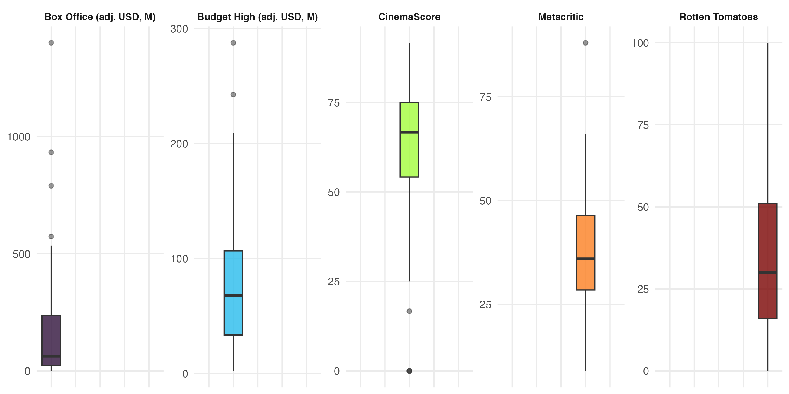
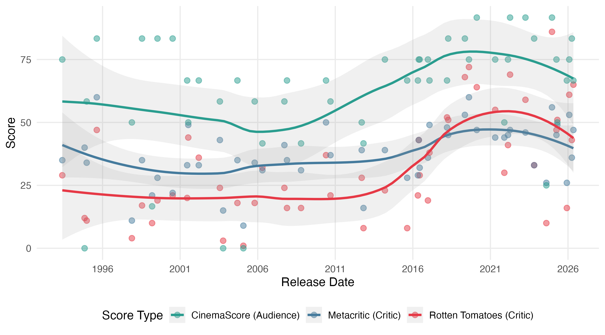
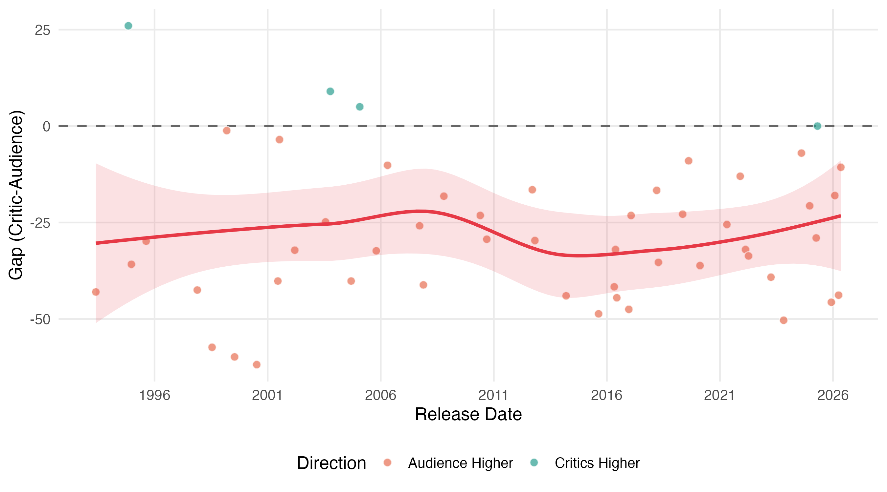
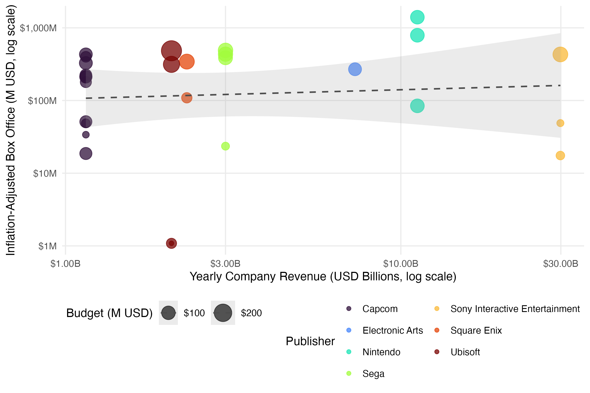
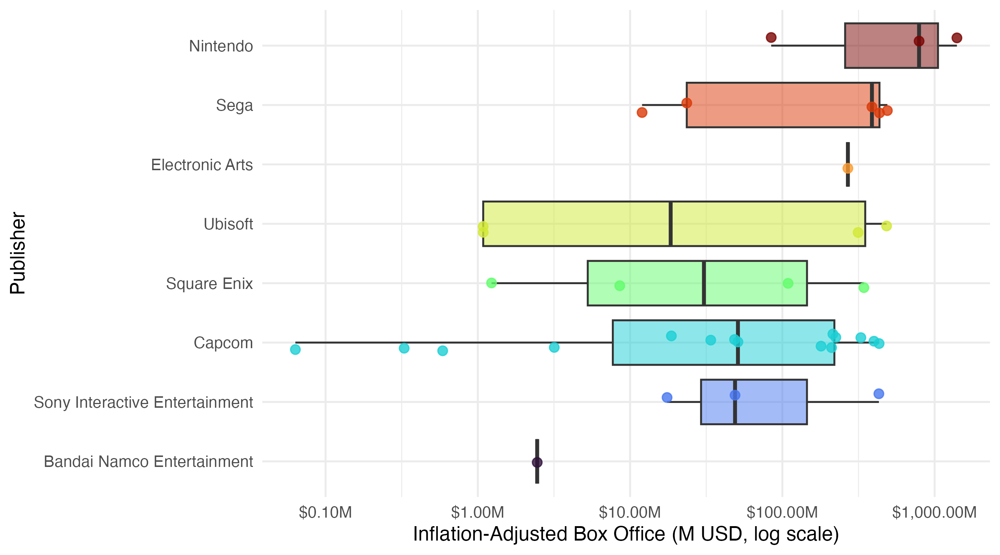
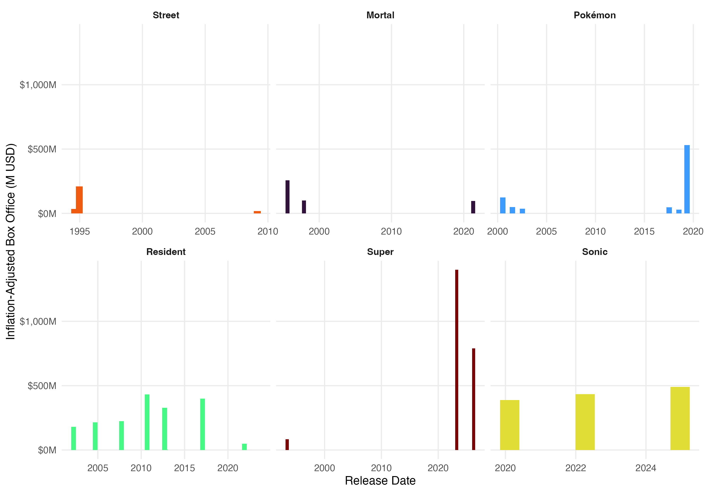
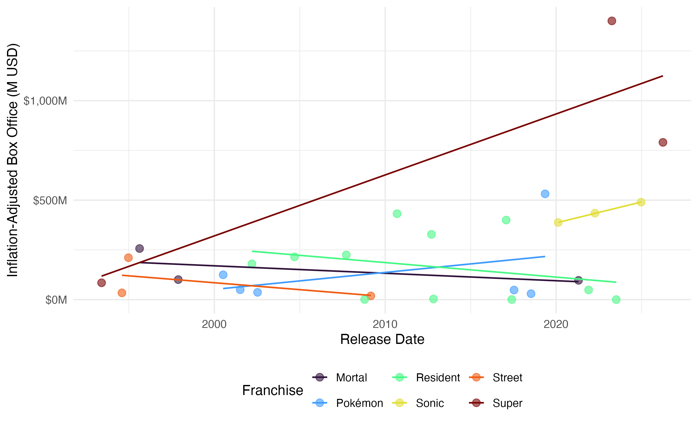
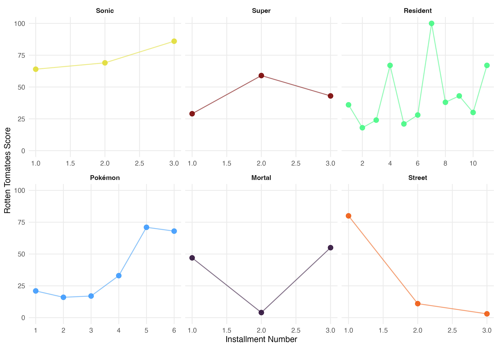
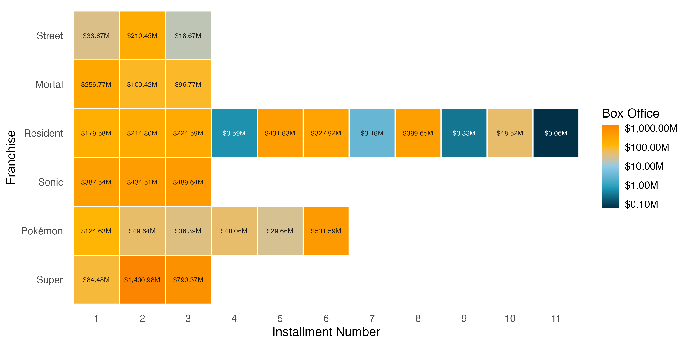
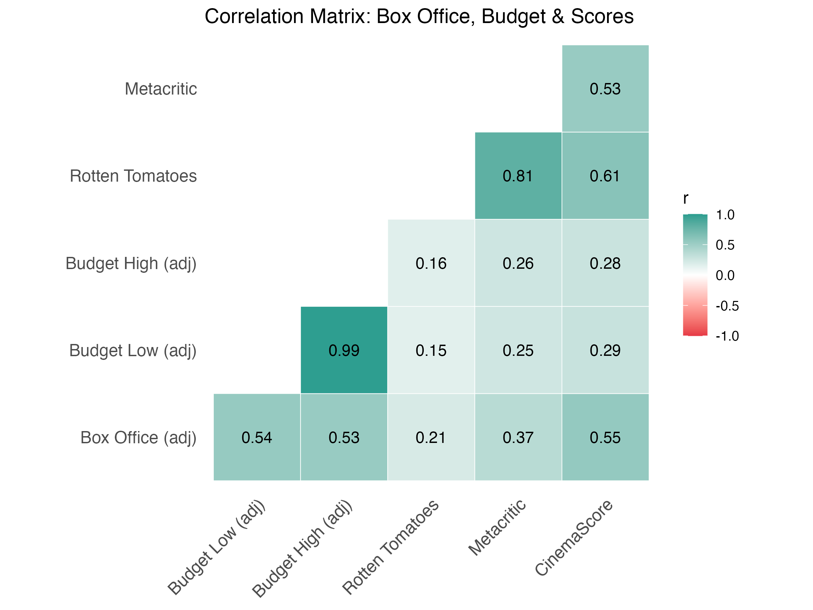

```{r setup}
#| label: setup
#| message: false
#| warning: false
#| echo: false

library(tidyverse)
library(readr)
library(janitor)
library(scales)
library(rvest)
library(lubridate)
library(ggcorrplot)
library(patchwork)
library(ggridges)
library(kableExtra)
library(viridis)

knitr::opts_chunk$set(echo = FALSE, warning = FALSE, message = FALSE)
ggplot2::theme_set(theme_minimal(base_size = 12))
```

## Introduction & Motivation

Video game movies have a reputation, and it's mostly earned. The genre goes back to the 1980s, and for most of that stretch it was a punchline more than a category. Then once in a while a movie actually works. *The Super Mario Bros. Movie* pulled in $1.3 billion in 2023, off the same character that anchored 1993's *Super Mario Bros.*, a film that regularly shows up on worst-of-all-time lists. Same IP, three decades apart, two totally different outcomes. That gap is basically what got us interested in this dataset in the first place.

The misses keep coming even now. *Street Fighter* tanked in 1994, *Monster Hunter* came and went without much notice in 2020, and the 2021 *Resident Evil* reboot didn't do much better. But plenty of other adaptations have done fine, and a handful have done great, so something is clearly separating the hits from the misses.

We picked three angles to chase that down: whether critics and audiences even agree on these films, whether a publisher's size actually predicts box office, and whether these franchises burn out the same way ordinary Hollywood series do. The dataset runs from 1986 to 2026, which is enough runway to dig into all three.

## Research Questions

We focused on three questions:

1. **Critic-Audience Agreement Over Time**: Do critics and audiences agree on video game films? Has the gap between them changed?

2. **Publisher Size and Box Office Performance**: Does the size of the game publisher predict how much money its film adaptation makes?

3. **Franchise Fatigue**: Do video game film franchises make less money and get worse reviews with each new installment?

## Data Provenance

### Primary Dataset

Our main data source is the TidyTuesday *Game Films* dataset from June 9, 2026, hosted on the rfordatascience/tidytuesday GitHub repo [2]. The data was scraped from Wikipedia's "List of films based on video games" [1]. Each row is one film adaptation.

The raw dataset has 439 rows and 19 variables: title, release date, category (theatrical, direct-to-video, TV, etc.), original game publisher, worldwide box office with currency label, budget bounds, Rotten Tomatoes score, Metacritic score, CinemaScore audience grade, and distributor info.

### Supplementary Data

We added two external sources:

- **CPI-U Inflation Data**: U.S. Bureau of Labor Statistics CPI-U annual averages, 1986 to 2026 [3]. We used these to adjust all dollar amounts to 2024 dollars so we could compare box office across decades.

- **Publisher Revenue Data**: Wikipedia's "List of largest video game companies by revenue" [4], scraped directly from the page. This gives estimated yearly revenue for major publishers, which we used as a proxy for company size.

```{r provenance-load}
#| label: provenance-load
#| echo: false

game_films <- readr::read_csv(
  "https://raw.githubusercontent.com/rfordatascience/tidytuesday/main/data/2026/2026-06-09/game_films.csv",
  show_col_types = FALSE
) |>
  janitor::clean_names()
```

## Data Wrangling & Cleaning

We ran several cleaning steps to get the data ready. We describe each one below.

### Variable Selection

We kept the variables relevant to our three questions. @tbl-vars-quant and @tbl-vars-cat list them by type, since quantitative and categorical variables call for different summary statistics.

```{r variable-tables}
#| label: tbl-vars-quant
#| tbl-cap: "Quantitative variables used in this analysis"

tibble::tribble(
  ~Variable, ~Description, ~`Used in`,
  "release_date",              "Date the film was released",                          "Time trends (Q1, Q3)",
  "worldwide_box_office",      "Box office total, inflation-adjusted to 2024 USD",     "Q2, Q3",
  "budget_low / budget_high",  "Production budget range, inflation-adjusted",          "Q2",
  "rotten_tomatoes",           "Critic aggregate score, 0-100",                        "Q1, Q3",
  "metacritic",                "Critic aggregate score, 0-100",                        "Q1",
  "cinema_score",              "Audience survey grade, converted to a 0-100 scale",    "Q1"
) |>
  kable(align = c("l", "l", "l")) |>
  kable_styling(bootstrap_options = c("striped", "hover", "condensed"), full_width = FALSE) |>
  row_spec(0, bold = TRUE)
```

```{r variable-tables-cat}
#| label: tbl-vars-cat
#| tbl-cap: "Categorical variables used in this analysis"

tibble::tribble(
  ~Variable, ~Description, ~`Used in`,
  "title",                    "Film title",                                                "Franchise detection (Q3)",
  "category",                 "Distribution type (theatrical, direct-to-video, TV, etc.)", "Filtering to theatrical releases",
  "original_game_publisher",  "Studio/publisher of the source game",                       "Q2"
) |>
  kable(align = c("l", "l", "l")) |>
  kable_styling(bootstrap_options = c("striped", "hover", "condensed"), full_width = FALSE) |>
  row_spec(0, bold = TRUE)
```

### Currency Standardization

The raw monetary values use their original currencies, marked by a separate currency column. We converted everything to USD with the exchange rates below, taken from the Federal Reserve's H.10 Foreign Exchange Rates release as of June 22, 2026 [7]:

```{r currency-table}
#| label: currency-table
#| echo: false

fx_rates <- tibble::tribble(
  ~currency, ~to_usd,
  "$",        1,
  "¥",        0.0091,
  "£",        1.30,
  "HK$",      0.128,
  "NT$",      0.033
)

fx_rates |>
  rename(Currency = currency, `USD per Unit` = to_usd) |>
  kable(caption = "Exchange rates used for currency standardization (Federal Reserve H.10 release, as of 2026-06-22)", digits = 4) |>
  kable_styling(bootstrap_options = c("striped", "condensed"), full_width = FALSE)
```

We joined this table to the main dataset on the original currency labels for both box office and budget figures. This created new columns holding box office and budget figures in USD.

```{r currency-convert}
#| label: currency-convert
#| echo: false

game_films <- game_films |>
  left_join(fx_rates, by = c("worldwide_box_office_currency" = "currency")) |>
  mutate(worldwide_box_office_usd = worldwide_box_office * to_usd) |>
  select(-to_usd) |>
  left_join(fx_rates, by = c("budget_currency" = "currency")) |>
  mutate(
    budget_low_usd  = budget_low  * to_usd,
    budget_high_usd = budget_high * to_usd
  ) |>
  select(-to_usd)
```

### Inflation Adjustment

Comparing box office across decades means adjusting for inflation. We added a CPI-U table, matched on the year a film was released, and scaled every dollar amount by the ratio of the 2024 CPI to that year's CPI. This puts everything in constant 2024 dollars. A dollar earned in 1993 counts the same as a dollar earned in 2024.

Our first pass only covered 1986 to 2024, which silently dropped seven theatrical films with box office data out of every adjusted figure and table, including some of the biggest titles in the dataset (*A Minecraft Movie*, *The Super Mario Galaxy Movie*). We extended the table through 2026 to fix this. The 2025 value is the official annual average; 2026 is a year-to-date average through May since the year is still in progress, not a finalized annual figure.

```{r cpi-data}
#| label: cpi-data
#| echo: false

cpi <- tibble::tribble(
  ~year, ~cpi,
  1986, 109.6, 1987, 113.6, 1988, 118.3, 1989, 124.0,
  1990, 130.7, 1991, 136.2, 1992, 140.3, 1993, 144.5,
  1994, 148.2, 1995, 152.4, 1996, 156.9, 1997, 160.5,
  1998, 163.0, 1999, 166.6, 2000, 172.2, 2001, 177.1,
  2002, 179.9, 2003, 184.0, 2004, 188.9, 2005, 195.3,
  2006, 201.6, 2007, 207.3, 2008, 215.3, 2009, 214.5,
  2010, 218.1, 2011, 224.9, 2012, 229.6, 2013, 233.0,
  2014, 236.7, 2015, 237.0, 2016, 240.0, 2017, 245.1,
  2018, 251.1, 2019, 255.7, 2020, 258.8, 2021, 271.0,
  2022, 292.7, 2023, 304.7, 2024, 313.7,
  2025, 321.9, 2026, 330.1
)

cpi_2024 <- cpi$cpi[cpi$year == 2024]

game_films <- game_films |>
  mutate(release_year = lubridate::year(release_date)) |>
  left_join(cpi, by = c("release_year" = "year")) |>
  mutate(
    inflation_factor = cpi_2024 / cpi,
    worldwide_box_office_usd_adj = worldwide_box_office_usd * inflation_factor,
    budget_low_usd_adj  = budget_low_usd  * inflation_factor,
    budget_high_usd_adj = budget_high_usd * inflation_factor
  ) |>
  select(-cpi, -inflation_factor)
```

### Film Category Filtering

The dataset covers several distribution types, including direct-to-video and TV specials. These tend to have spotty financial and review data. We filtered to only theatrical releases since those have the most complete records.

```{r theatrical-filter}
#| label: theatrical-filter
#| echo: false

game_films <- game_films %>%
  filter(category == "Theatrical releases")
```

### CinemaScore Conversion

The CinemaScore column stores letter grades (A+ to F) as text, plus a not-available marker for films with no score. To run numbers on it, we mapped each letter to a 0 to 100 scale. Films with no score were left out of any analysis that needs audience scores.

```{r cinema-convert}
#| label: cinema-convert
#| echo: false

cinema_score_conversion <- tibble::tribble(
  ~cinemascore_letter, ~to_num,
  "N/A",        NA,
  "A+",        100,   "A",   91.6666,  "A-",  83.3333,
  "B+",        74.9999, "B", 66.6666,  "B-",  58.3333,
  "C+",        49.9999, "C", 41.6666,  "C-",  33.3333,
  "D+",        24.9999, "D", 16.6666,  "D-",   8.3333,
  "F",          0
)

game_films <- game_films %>%
  left_join(cinema_score_conversion, join_by("cinema_score" == "cinemascore_letter"))

game_films <- game_films %>%
  mutate(cinema_score = to_num) %>%
  select(-starts_with("to_num"))
```

### Final Dataset Overview

After all cleaning, the dataset is theatrical-release video game films with standardized USD financials adjusted to 2024 dollars and a numeric cinema score. Here is a summary:

```{r final-summary}
#| label: final-summary
#| echo: false

game_films |>
  summarise(
    `Total Films`     = n(),
    `Box Office Data` = sum(!is.na(worldwide_box_office_usd_adj)),
    `RT Score`        = sum(!is.na(rotten_tomatoes)),
    `Metacritic`      = sum(!is.na(metacritic)),
    `CinemaScore`     = sum(!is.na(cinema_score)),
    `Date Range`      = paste(range(release_date, na.rm = TRUE), collapse = " to ")
  ) |>
  kable(
    caption = "Overview of the cleaned dataset after all preparation steps",
    digits  = 0,
    align   = "l"
  ) |>
  kable_styling(bootstrap_options = c("striped", "hover", "condensed"), full_width = FALSE,
                font_size = 10, latex_options = c("scale_down"))
```

## Exploratory Data Analysis

We did a lot of EDA to dig into the three questions. This section walks through the main tables and figures. Each one is numbered, captioned, and discussed below.

### Descriptive Statistics

@tbl-summary-stats shows the mean, median, standard deviation, min, and max for the key numeric variables.

```{r summary-stats-table}
#| label: tbl-summary-stats
#| tbl-cap: "Summary Statistics for Key Numeric Variables"
#| echo: false

game_films |>
  select(
    worldwide_box_office_usd_adj,
    budget_high_usd_adj,
    rotten_tomatoes,
    metacritic,
    cinema_score
  ) |>
  summarise(across(everything(), list(
    Mean   = ~mean(.x, na.rm = TRUE),
    Median = ~median(.x, na.rm = TRUE),
    SD     = ~sd(.x, na.rm = TRUE),
    Min    = ~min(.x, na.rm = TRUE),
    Max    = ~max(.x, na.rm = TRUE)
  ))) |>
  pivot_longer(everything(), names_to = c("Variable", "Statistic"), names_pattern = "(.*)_(Mean|Median|SD|Min|Max)$") |>
  pivot_wider(names_from = Statistic, values_from = value) |>
  mutate(Variable = recode(Variable,
    worldwide_box_office_usd_adj = "Box Office (adj. USD)",
    budget_high_usd_adj         = "Budget High (adj. USD)",
    rotten_tomatoes             = "Rotten Tomatoes",
    metacritic                  = "Metacritic",
    cinema_score                = "CinemaScore"
  )) |>
  kable(digits = 1, align = c("l", rep("r", 5)), format.args = list(big.mark = ",")) |>
  kable_styling(bootstrap_options = c("striped", "hover", "condensed"), full_width = FALSE) |>
  row_spec(0, bold = TRUE)
```

Box office values span from near zero to over a billion dollars after inflation adjustment. The distribution is heavily right-skewed, which is common for entertainment industry money. Critic scores (Rotten Tomatoes and Metacritic) average in the mid-30s, so video game films mostly get bad reviews, not just lukewarm ones. CinemaScore audience grades land around 60 on our 0 to 100 scale. That is a lot higher than critic scores, which points toward the gap we look at in Q1.

{#fig-desc-boxplot}

@fig-desc-boxplot shows the same story as the table: box office and budget are both right-skewed with a handful of high-end outliers, while the three score variables are roughly centered with CinemaScore sitting noticeably higher than the two critic scores.

```{r best-worst-table}
#| label: tbl-best-worst
#| tbl-cap: "Best and worst performing films by box office and critic score"

best_worst <- tibble::tribble(
  ~Category, ~Film, ~Value,
  "Highest box office (adj.)",  game_films$title[which.max(game_films$worldwide_box_office_usd_adj)],  scales::dollar(max(game_films$worldwide_box_office_usd_adj, na.rm = TRUE)),
  "Lowest box office (adj.)",   game_films$title[which.min(game_films$worldwide_box_office_usd_adj)],  scales::dollar(min(game_films$worldwide_box_office_usd_adj, na.rm = TRUE)),
  "Highest Rotten Tomatoes",    game_films$title[which.max(game_films$rotten_tomatoes)],                paste0(max(game_films$rotten_tomatoes, na.rm = TRUE), "/100"),
  "Lowest Rotten Tomatoes",     game_films$title[which.min(game_films$rotten_tomatoes)],                paste0(min(game_films$rotten_tomatoes, na.rm = TRUE), "/100")
)

best_worst |>
  kable(align = c("l", "l", "r")) |>
  kable_styling(bootstrap_options = c("striped", "hover", "condensed"), full_width = FALSE) |>
  row_spec(0, bold = TRUE)
```

@tbl-best-worst puts names to the extremes. *The Super Mario Bros. Movie* is the highest grossing film in the dataset after inflation adjustment, and *Resident Evil: Damnation* is the best reviewed on Rotten Tomatoes. On the other end, *Resident Evil: Death Island* made almost nothing at the box office, and *Tekken* sits at a 0 on Rotten Tomatoes, the lowest score in the dataset.

---

### Q1: Critic-Audience Agreement Over Time

Our first question: do critics and audiences agree on video game films? Has the gap changed since 1986? We compared three score types: Rotten Tomatoes (critic aggregate), Metacritic (critic aggregate), and CinemaScore (audience survey, converted to numeric).

@fig-q1-scatter plots all three against release date with loess-smoothed trend lines and 95% confidence bands.

{#fig-q1-scatter}

A few things stand out in @fig-q1-scatter. CinemaScore (audience) ratings sit above both critic metrics across the whole timeline. The loess CinemaScore trend runs between 60 and 70. Rotten Tomatoes and Metacritic cluster in the 40 to 55 range. Audiences rate these films about 28 points higher than critics on average, and this has been true since the start. All three score types also show a slow upward trend after about 2010. That might be because studios started taking video game adaptations more seriously after the early failures, though we have no direct way to test that.

To measure the gap directly, @fig-q1-gap shows the difference between average critic scores (mean of Rotten Tomatoes and Metacritic) and CinemaScore. Points above zero mean critics scored higher. Points below mean audiences scored higher.

{#fig-q1-gap}

@fig-q1-gap shows most films fall below zero. Audiences rate these movies higher than critics almost every time, only 4 of the 51 films with both scores have critics rating higher. The loess trend suggests the gap has narrowed a bit since 2010, though the confidence band gets wider in recent years because there are fewer data points. Four decades of negative gaps point to a real split between how paid critics and regular moviegoers judge video game films.

Part of this is a known quirk of CinemaScore itself, not just a video-game-movie thing. CinemaScore only surveys people who already paid to see a film opening night, so the sample skews toward people predisposed to like what they are about to watch. In this dataset, 38 of the 51 scored films (about 75%) got a CinemaScore of B- or better. Critics, by contrast, are reviewing the film on its merits rather than reacting as a self-selected fan in the seat. That structural difference in who is doing the rating, not just a difference in taste, explains a meaningful chunk of the gap.

**Key findings for Q1**: Audiences rate video game films higher than critics by about 28 points on average. That gap has narrowed a little since 2010. All score types trended up over the same period, so the genre might be getting better, or at least better received.

---

### Q2: Publisher Size and Box Office Performance

Our second question: do bigger publishers produce film adaptations that make more money? The idea makes sense. A company like Nintendo has far more money than a smaller publisher, so you might expect their films to get bigger budgets, better marketing, and higher returns.

To check, we scraped Wikipedia's list of the largest video game companies by yearly revenue and joined it with our film dataset. After matching and dropping rows with missing data, we had 96 films across 34 publishers. @tbl-publisher-performance narrows that down to the 10 publishers with at least three matched films, 67 films in total.

@tbl-publisher-performance shows the aggregated numbers for publishers with at least three films in the matched set, ranked by mean inflation-adjusted box office.

```{r tbl-publisher-performance}
#| label: tbl-publisher-performance
#| tbl-cap: "Publisher performance, 3+ matched films, sorted by mean box office"

# Scrape and join publisher data
company_url <- "https://en.wikipedia.org/wiki/List_of_largest_video_game_companies_by_revenue"
TablesRedun <- company_url |>
  read_html() |>
  html_elements("table") |>
  html_table()
top_50 <- TablesRedun[[2]]

top_50_clean <- clean_names(top_50) %>%
  mutate(revenue_usd_billions = parse_number(revenue_usd)) %>%
  select(!c(ref, revenue_usd))

pub_joined <- as.data.frame(top_50_clean) %>%
  right_join(game_films, join_by("company" == "original_game_publisher"), copy)

table_data <- pub_joined %>%
  filter(!is.na(worldwide_box_office_usd_adj)) %>%
  group_by(company) %>%
  summarise(
    `Films`     = n(),
    `Med BO`    = round(median(worldwide_box_office_usd_adj) / 1e6, 1),
    `Mean BO`   = round(mean(worldwide_box_office_usd_adj) / 1e6, 1),
    `Mean RT`   = round(mean(rotten_tomatoes, na.rm = TRUE), 1),
    `Mean CS`   = round(mean(cinema_score, na.rm = TRUE), 1),
    .groups = "drop"
  ) %>%
  filter(`Films` >= 3) %>%
  arrange(desc(`Mean BO`)) %>%
  rename(Publisher = company) %>%
  mutate(
    Publisher = str_replace_all(Publisher, fixed("|"), "/"),
    `Mean RT` = ifelse(is.nan(`Mean RT`), "N/A", as.character(`Mean RT`)),
    `Mean CS` = ifelse(is.nan(`Mean CS`), "N/A", as.character(`Mean CS`))
  )

table_data %>%
  kable(digits = 1, align = c("l", rep("r", 5)), format.args = list(big.mark = ",")) %>%
  kable_styling(bootstrap_options = c("striped", "hover", "condensed"), full_width = FALSE,
                font_size = 9, latex_options = c("scale_down")) %>%
  column_spec(1, width = "4.5cm") %>%
  row_spec(0, bold = TRUE, color = "white", background = "#2A9D8F") %>%
  footnote(general = "BO = inflation-adjusted box office in millions USD. CS = CinemaScore.",
           general_title = "", footnote_as_chunk = TRUE)
```

@fig-q2-multivariate is our 3+ variable figure. It packs four variables into one plot: publisher revenue (x axis, log scale), inflation-adjusted box office (y axis, log scale), publisher identity (color), and film budget (point size).

{#fig-q2-multivariate}

The dashed LM line in @fig-q2-multivariate shows a very weak link between publisher revenue and box office. The two biggest earners in the sample are both Nintendo's *Super Mario* films, and Nintendo is one of the largest publishers by revenue. But most publishers cluster in a narrow band of box office numbers no matter their size. @fig-q2-ridge shows the same pattern another way, with the full distribution for every publisher rather than just the average.

{#fig-q2-ridge}

A density plot needs more than a couple of points to mean anything, and four of these eight publishers (Nintendo, Sony Interactive Entertainment, Bandai Namco Entertainment, and Electronic Arts) only have one to three matched films, so we used a boxplot with the individual films jittered alongside instead. That puts every publisher on the same chart, down to the ones with a single data point, while still showing real spread for publishers like Capcom (15 films) and Sega (5 films). Capcom, Square Enix, and Sega each cover a wide range, reflecting the uneven performance of their different franchises. Ubisoft's films split into a cluster of smaller earners and a separate cluster of bigger ones. The earnings ranges overlap heavily across these publishers, which backs up what we saw in @fig-q2-multivariate.

**Key findings for Q2**: A publisher's yearly revenue does not predict box office success very well. The biggest publishers do land occasional hits (Nintendo's *Super Mario* films), but smaller publishers like Capcom and Square Enix have put up comparable numbers. Which IP gets adapted and who makes the film seem to matter more than the size of the company behind it.

---

### Q3: Franchise Fatigue

Our third question: do video game film franchises burn out? That is, do later installments make less money and get worse reviews? This pattern shows up a lot in regular Hollywood franchises but hasn't been studied much for video game adaptations.

We found franchises by pulling the first meaningful word from each title (after dropping leading "The," "A," and "An") and grouping films that share that word. We numbered installments by release date within each group. We only kept franchises with three or more theatrical films. This gave us *Resident Evil*, *Pokemon*, *Mortal Kombat*, *Sonic*, *Street Fighter*, *Super Mario*, and others. One real limitation of this method: it missed a third *Silent Hill* film, *Return to Silent Hill* (2026), because that title doesn't start with "Silent," so the franchise never reached our three-film cutoff.

@fig-q3-box-office shows inflation-adjusted box office for each franchise as bars placed at their actual release date, so installments read left to right in chronological order.

{#fig-q3-box-office}

@fig-q3-box-office makes the swings within each franchise easy to read. *Sonic* is the cleanest growth story in the dataset: every film outearned the last. *Resident Evil*, with 11 theatrical films, the most of any franchise here, bounces between very large and very small installments rather than declining steadily, so "fatigue" undersells how uneven that series has been. *Pokemon* stayed fairly flat across most entries before a late installment broke far above the rest. *Super Mario* is the most extreme swing of all: from $84M for the 1993 original to $1.4 billion for the 2023 movie, then back down to $790M for the 2026 follow-up, still enormous, just not record-setting.

As a second look at the same question, @fig-q3-charlie plots every franchise together on one shared timeline by release date, with a linear trend fit per franchise and no confidence band.

{#fig-q3-charlie}

@fig-q3-charlie agrees with the faceted view on the main point: there is no single direction for the genre. *Sonic* and *Super Mario* trend up, *Street* and *Mortal* trend down, and *Resident Evil* and *Pokemon* sit in between with their trend lines roughly flat once everything is overlaid on the same axis.

@fig-q3-rt checks whether Rotten Tomatoes scores follow the same pattern.

{#fig-q3-rt}

Critic scores show no single direction once you look franchise by franchise. *Sonic* and *Pokemon* actually trend up, not down. *Street Fighter* shows the clearest decline in the dataset. *Resident Evil* and *Mortal Kombat* bounce around without a consistent direction, including a swing in *Resident Evil* from a 100 on one installment down to single digits on others just a couple of entries later. Critic fatigue is not the universal pattern here that it is sometimes assumed to be for franchise filmmaking in general.

@fig-q3-heatmap gives a different view: a tile heatmap where color tracks box office on a log scale, making it easy to compare franchises across installments.

{#fig-q3-heatmap}

The heatmap in @fig-q3-heatmap makes installment-to-installment swings easy to spot. *Sonic* climbs toward the orange end of the scale with every release, a clean sign of growth rather than fatigue. *Resident Evil* swings repeatedly between the navy low end and the orange high end rather than moving steadily in either direction, so its installments are better described as uneven than as a steady decline. Smaller franchises with only a few installments do not show enough data to call a direction either way.

**Key findings for Q3**: Franchise fatigue is not a consistent pattern in this dataset, in box office or in critic scores. Box office swings up and down within most franchises, *Resident Evil* is the extreme case, more than it steadily declines. Critic scores are just as mixed: *Sonic*, *Pokemon*, and *Super Mario* trend up across installments, *Street Fighter* trends down, and *Resident Evil* and *Mortal Kombat* show no clear direction at all. If fatigue exists here, it looks specific to the franchise rather than a property of the genre.

---

### Correlation Analysis

@fig-correlation shows a correlation matrix of all the key numeric variables. Each cell is colored on a diverging red-white-teal scale (red = negative, teal = positive), darker meaning a stronger relationship, with the exact value printed in the cell. Read it the same way you would a heatmap: scan for the darkest squares first, those are the strongest relationships, and treat the pale, near-white ones as essentially no relationship.

{#fig-correlation}

A few things worth pointing out from @fig-correlation. Budget and box office have a moderate positive correlation (r around 0.53 to 0.54). More expensive films tend to earn more, but not always. A big budget is not a guarantee. Rotten Tomatoes and Metacritic are tightly correlated (r = 0.81), which makes sense since both aggregate critic reviews. CinemaScore (audience) correlates with both critic metrics more than we expected (r = 0.61 with Rotten Tomatoes, 0.53 with Metacritic), matching what we found in Q1: audiences and critics move in the same general direction, just at different levels. The weakest correlation in the matrix is between budget and Rotten Tomatoes (r around 0.15 to 0.16). Spending more money on a film does not seem to make critics like it more.

## Findings / Conclusions

We looked at three questions about video game film adaptations across 1986 to 2026. Here is what we found:

**Q1: Critic-Audience Agreement**. Audiences give video game films higher scores than critics do, by about 28 points on a 0 to 100 scale. That gap has shrunk a little since 2010. All score types drifted up over the same period.

**Q2: Publisher Size and Box Office**. A publisher's yearly revenue does not tell you much about how well its film adaptations will do. The biggest publishers land hits sometimes (Nintendo's *Super Mario* films), but smaller publishers get comparable results. The IP itself and the people making the film seem to matter more than the company's size.

**Q3: Franchise Fatigue**. We did not find a consistent fatigue pattern, in box office or in critic scores. Most franchises swing up and down installment to installment more than they steadily decline; *Resident Evil*, the biggest franchise in the dataset with 11 theatrical films, is the extreme case of this in both measures. A couple of franchises trend in one clear direction (*Sonic* up, *Street Fighter* down), but that looks like a franchise-specific story rather than a general rule for the genre.

Stepping back, these films have always been received coldly by critics and warmly by audiences. That gap might be closing as the industry figures out what works. Money seems to follow the specific property and execution more than the publisher's bank account. And franchise building has real limits: the returns shrink with each new installment.

## Biases in the Data

A few patterns here are not analysis mistakes. They are baked into what is actually being measured, and they are worth calling out on their own, separate from the data-quality limitations below.

**CinemaScore favors the already-convinced.** CinemaScore only surveys people who paid for a ticket on opening night, a self-selected group who showed up before anyone could tell them whether the movie was any good. Critics do not get that built-in goodwill; they are reviewing the film on its merits after the fact. Some of the audience-critic gap in Q1 is really a gap in who is doing the rating, not just a gap in taste.

**Franchise strength and publisher size are tangled together, and we cannot cleanly separate them.** Q2 asks whether a publisher's revenue predicts box office, and Q3 asks whether franchises wear out over time. But *Super Mario* and *Pokemon* walk into a theater with decades of built-in trust from games, TV, toys, and theme parks. Audiences already like the characters before the movie starts. *Resident Evil*, despite being the longest-running franchise in this dataset, has never had that same kind of broad, family-friendly brand goodwill; it has to earn its audience one film at a time. That pre-existing trust is tangled up with both publisher size (Nintendo and The Pokemon Company are large in part because their characters are everywhere) and franchise longevity (well-loved IP gets more sequels greenlit in the first place). Some of what looks like a publisher-size effect in Q2 or a franchise-fatigue effect in Q3 may really be an IP-strength effect sitting underneath both.

**The dataset only contains films that got made.** We only see adaptations a studio decided were worth greenlighting and finishing. Games or franchises that publishers considered adapting and shelved, or films that were finished but never got a wide release, do not show up here. That survivorship filter likely tilts the dataset toward IP that publishers already believed was commercially safe, which reinforces the same bias described above.

## Limitations & Future Work

A few things to keep in mind when reading these results:

- **Exchange Rates**: We used fixed approximate rates. Actual historical daily rates would be more accurate, especially for Japanese and Hong Kong films where exchange rates moved a lot over the decades.

- **CPI Data**: We used annual CPI-U averages, including a year-to-date average for 2026 since that year is not finished. Monthly adjustment would tighten the inflation correction for films released early or late in a given year, and the 2026 figure will shift once the full year is final.

- **Missing Data**: A lot of films in the original dataset are missing box office numbers, review scores, or both. Older and smaller releases are hit hardest. Our analysis only uses films with complete data, which probably skews toward bigger, more documented releases.

- **Publisher Revenue Matching**: Only some publishers in the film dataset matched the Wikipedia list. Many smaller or defunct publishers were left out of Q2, which limits how broadly our findings apply.

- **Franchise Detection**: Our first-word method is crude. It might lump unrelated films together if they share a first word, and it misses sequels where the first word changes, which is exactly what happened to *Silent Hill*: *Return to Silent Hill* (2026) doesn't start with "Silent," so it never counted toward that franchise's total. A better approach would use a more careful regex or manual franchise coding.

- **Causality**: All the analyses in this project are correlational. We cannot say, for example, that publisher size causes higher box office, or that a few successful films inflate publisher revenue numbers.

Future work could go a few directions: adding genre and rating data to control for film traits, building a predictive model for box office from publisher and critic variables, looking at release strategies (staggered vs. simultaneous), or checking whether the timing between a game's release and its film adaptation affects the box office.

## AI Use Statement

**Harsh Rathi**: Used AI to ask for suggestions on improving the report, to compare the draft against the example qmd and the rubric for gaps, to format code into clean aligned blocks, and to create the rubric and example qmd documents in the dev folder. Also used AI to debug the GitHub CI workflow. No code completion or generation was used.

**Charles Bupp**: [Describe how you used AI tools in your contributions]

**Mason Mitchell**: AI was used to get a starting point for creating the presentation

## References

1. Wikipedia contributors. "List of films based on video games." Wikipedia, The Free Encyclopedia. `https://en.wikipedia.org/wiki/List_of_films_based_on_video_games`

2. TidyTuesday (2026). Game Films dataset. `https://github.com/rfordatascience/tidytuesday/tree/main/data/2026/2026-06-09`

3. U.S. Bureau of Labor Statistics / Federal Reserve Economic Data (FRED). Consumer Price Index for All Urban Consumers (CPI-U), series CPIAUCNS, annual averages 1986-2025; 2026 figure is a year-to-date average through May 2026, not a finalized annual figure. Retrieved from `https://fred.stlouisfed.org/series/CPIAUCNS`

4. Wikipedia contributors. "List of largest video game companies by revenue." Wikipedia, The Free Encyclopedia. `https://en.wikipedia.org/wiki/List_of_largest_video_game_companies_by_revenue`

5. R Core Team (2024). R: A language and environment for statistical computing. R Foundation for Statistical Computing, Vienna, Austria.

6. Wickham, H., et al. (2019). Welcome to the tidyverse. *Journal of Open Source Software*, 4(43), 1686.

7. Board of Governors of the Federal Reserve System. H.10 Foreign Exchange Rates. Retrieved June 22, 2026, from `https://www.federalreserve.gov/releases/h10/`
